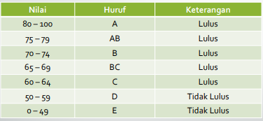

# Laporan Praktikum 5

## Informasi

**Nama:** Ibnu Shabill Al Zahari  
**NIM:** 2411102441264  
**Mata Kuliah:** Praktikum Pemrograman Web  
**Tanggal:** 13 Oktober 2025

---

## Pendahuluan

Praktikum ini membahas tentang fundamental JavaScript. JavaScript merupakan bahasa pemrograman yang untuk membuat halaman web yang dinamis dan responsif. Dalam praktikum ini dipelajari berbagai konsep dasar JavaScript mulai dari cara penulisan script, variabel dan tipe data, operasi matematika, struktur kontrol percabangan dan perulangan, hingga validasi form dan manipulasi DOM.

---

## Soal 1

Soal praktikum satu ini mengklasifikasikan nilai dalam rentang 0-100 menjadi grade huruf A, AB, B, BC, C, D, dan E dengan kriteria sebagai berikut:

Code dimulai dengan validasi input menggunakan fungsi `validateInput()` yang memastikan user memasukkan nilai yang valid. Fungsi ini melakukan pengecekan apakah input berupa angka menggunakan `isNaN()` dan apakah nilai berada dalam rentang 0-100. Validasi dijalankan dalam do-while loop yang akan terus meminta input sampai user memasukkan data yang valid, mencegah error yang mungkin terjadi dari invalid input. 

Setelah input valid diperoleh, fungsi `setClasification()` menentukan grade dan status kelulusan menggunakan struktur if-else bertingkat. Fungsi ini mengembalikan object yang berisi nilai numerik, grade huruf, dan keterangan lulus atau tidak lulus. Penggunaan if-else bertingkat memungkinkan program untuk melakukan klasifikasi yang detail berdasarkan rentang nilai yang berbeda. Object yang dikembalikan memudahkan pengelolaan data hasil klasifikasi untuk proses selanjutnya.

Selanjutnya manipulasi DOM dan styling dinamis melalui fungsi `displayResult()`. Fungsi ini mengubah innerHTML dari body element untuk menampilkan hasil dalam format yang terstruktur dengan HTML yang di-generate secara dinamis. Data ditampilkan dalam container dengan class CSS yang berbeda berdasarkan status kelulusan, dimana class `lulus` memberikan styling hijau yang positif sedangkan class `tidak-lulus` memberikan styling merah yang menunjukkan hasil negatif.

## Soal 2

Soal praktikum kedua fokus pada implementasi struktur perulangan for loop dengan cara yang sederhana . Program meminta user untuk memasukkan sebuah angka melalui `prompt()`, kemudian menampilkan teks "Sampai jumpa kembali" sebanyak n kali sesuai dengan angka yang diinputkan. Setiap baris output dilengkapi dengan nomor urut yang di-generate oleh counter loop, memberikan visualisasi jelas tentang iterasi yang sedang berjalan.

---

## Kesimpulan

Implementasi praktikum ini memberikan pemahaman mendalam tentang penggunaan JavaScript untuk validasi input, pengkondisian logika, manipulasi DOM, dan styling dinamis. Praktikum ini menekankan pentingnya validasi input untuk memastikan data yang diproses adalah valid, serta bagaimana struktur kontrol seperti if-else dan for loop dapat digunakan untuk mengelola alur program secara efektif. Selain itu, integrasi antara JavaScript, HTML, dan CSS dalam menampilkan hasil secara dinamis menunjukkan bagaimana ketiga teknologi ini bekerja bersama untuk menciptakan pengalaman pengguna yang interaktif dan menarik.