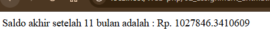
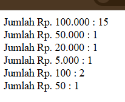

# Laporan Praktikum 7
---

## Informasi

**Nama:** Ibnu Shabill Al Zahari  
**NIM:** 2411102441264  
**Mata Kuliah:** Praktikum Pemrograman Web  
**Tanggal:** 24 Oktober 2025

---

## 1. Pendahuluan

Praktikum kali ini membahas tentang operator assignment dan aritmatika dalam PHP. Operator merupakan simbol yang digunakan untuk melakukan operasi tertentu pada variabel dan nilai. Dalam pemrograman PHP, operator assignment digunakan untuk memberikan nilai kepada variabel, sedangkan operator aritmatika digunakan untuk melakukan operasi matematika dasar seperti penjumlahan, pengurangan, perkalian, pembagian, dan modulus.

Pemahaman yang baik tentang operator assignment dan aritmatika sangat penting dalam pemrograman karena hampir setiap program melibatkan manipulasi data numerik dan perhitungan matematis. Selain itu, operator-operator ini juga sering digunakan dalam penyelesaian masalah-masalah komputasi yang lebih kompleks seperti perhitungan keuangan, konversi nilai, dan pemrosesan data.

---

## 2. Operator Assignment dan Aritmatika

Dalam praktikum ini, dipelajari berbagai jenis operator assignment dan aritmatika dalam PHP. Operator assignment mencakup assignment by value dimana nilai variabel disalin ke variabel lain sehingga perubahan pada satu variabel tidak mempengaruhi yang lain, assignment by array untuk menyimpan kumpulan data dalam satu variabel, dan assignment by reference dimana variabel merujuk ke lokasi memori yang sama sehingga perubahan pada satu variabel akan mempengaruhi variabel lainnya. Operator aritmatika dasar meliputi penjumlahan, pengurangan, perkalian, pembagian, dan modulus yang digunakan untuk operasi matematika.

Selain itu, juga dipelajari tentang presedensi operator yang menentukan urutan evaluasi ketika terdapat beberapa operator dalam satu ekspresi, dimana perkalian dan pembagian memiliki prioritas lebih tinggi dibanding penjumlahan dan pengurangan. Operator increment dan decrement digunakan untuk menambah atau mengurangi nilai variabel sebesar satu secara efisien. Pemahaman konsep-konsep ini sangat penting karena akan diterapkan dalam penyelesaian soal-soal praktikum yang melibatkan perhitungan matematis seperti perhitungan bunga tabungan dan penukaran pecahan uang.

---

## 3. Latihan Praktikum PHP

### 3.1 Soal 1
Ada seorang nasabah bank yang menabung di bank X dengan saldo awal Rp. 1.000.000,-. Bank X menerapkan kebijakan bunga 0,25% perbulan dari saldo awal tabungan. Hitunglah jumlah saldo akhir nasabah tersebut setelah 11 bulan. Lengkapilah script berikut ini untuk mengerjakan kasus ini!

#### Penjelasan
Permasalahan ini meminta kita untuk menghitung saldo akhir tabungan seorang nasabah setelah mendapatkan bunga selama 11 bulan. Nasabah memiliki saldo awal sebesar Rp. 1.000.000 dan bank memberikan bunga 0,25% per bulan. Untuk menyelesaikan masalah ini, digunakan rumus bunga majemuk karena bunga dihitung dari saldo yang terus bertambah setiap bulannya.

Dalam program PHP, pertama-tama dideklarasikan variabel saldoAwal dengan nilai 1000000 yang merepresentasikan saldo awal nasabah. Kemudian variabel bunga diisi dengan nilai 0.0025 yang merupakan konversi dari 0,25 persen ke bentuk desimal. Variabel bulan diisi dengan nilai 11 yang menunjukkan periode waktu tabungan. Rumus bunga majemuk yang digunakan adalah saldo akhir sama dengan saldo awal dikali dengan satu ditambah tingkat bunga dipangkatkan dengan jumlah bulan. Fungsi pow digunakan untuk melakukan operasi perpangkatan dalam perhitungan ini.

Hasil perhitungan menunjukkan bahwa saldo akhir nasabah setelah 11 bulan adalah Rp. 1.027.846,34. Ini berarti dalam 11 bulan, nasabah mendapatkan keuntungan bunga sebesar Rp. 27.846,34 dari saldo awal Rp. 1.000.000. Program ini kemudian menampilkan hasil menggunakan statement echo dengan format yang menjelaskan saldo akhir setelah periode tertentu. Operator concatenation (titik) digunakan untuk menggabungkan teks dengan nilai variabel dalam output.

### 3.2 Soal 2 - Penukaran Uang (soal_2.php)
Ibu ingin mengambil uang tabungan sejumlah Rp. 1.575.250,- yang dimilikinya di sebuah bank. Misalkan pada saat itu uang pecahan yang berlaku adalah Rp. 100.000,-; Rp. 50.000,-; Rp. 20.000,-; Rp. 5.000,-; Rp. 100,- dan Rp. 50. Dengan menggunakan script PHP, tentukan banyaknya masing-masing uang pecahan yang diperoleh ibu tadi!

#### Penjelasan
Permasalahan ini meminta kita untuk menghitung jumlah lembar masing-masing pecahan uang yang diterima ibu ketika mengambil uang tabungan sebesar Rp. 1.575.250. Pecahan uang yang tersedia adalah Rp. 100.000, Rp. 50.000, Rp. 20.000, Rp. 5.000, Rp. 100, dan Rp. 50. Tujuan dari program ini adalah menentukan komposisi pecahan uang yang optimal dengan menggunakan algoritma greedy, yaitu mengambil pecahan terbesar terlebih dahulu untuk meminimalkan jumlah lembar uang.

Dalam program PHP, dimulai dengan mendeklarasikan variabel jumlahUang dengan nilai 1575250 yang merepresentasikan total uang yang akan diambil. Untuk pecahan Rp. 100.000, digunakan operator pembagian integer untuk menghitung jumlah lembar dengan membagi jumlahUang dengan 100000, hasilnya disimpan dalam variabel `a`. Kemudian operator modulus digunakan untuk menghitung sisa uang yang belum ditukar dengan mengambil sisa pembagian jumlahUang dengan 100000, hasilnya disimpan kembali ke variabel `sisaUang`. Proses yang sama diterapkan secara berurutan untuk pecahan Rp. 50.000 (variabel `b`), Rp. 20.000 (variabel `c`), Rp. 5.000 (variabel `d`), Rp. 100 (variabel `e`), dan Rp. 50 (variabel `f`).

Hasil perhitungan menunjukkan bahwa ibu akan menerima 15 lembar uang Rp. 100.000, 1 lembar Rp. 50.000, 1 lembar Rp. 20.000, 1 lembar Rp. 5.000, 2 lembar Rp. 100, dan 1 lembar Rp. 50. Program kemudian menampilkan hasil menggunakan statement echo untuk setiap pecahan dengan tag br untuk membuat baris baru. Operator concatenation (titik) digunakan untuk menggabungkan teks keterangan dengan nilai variabel yang berisi jumlah lembar. Perhitungan ini membuktikan bahwa kombinasi operator aritmatika pembagian integer dan modulus sangat efektif untuk menyelesaikan masalah penukaran uang dalam aplikasi kasir atau sistem ATM.

---

## 4. Kesimpulan

Praktikum ini memberikan pemahaman mendalam tentang operator assignment dan aritmatika dalam PHP. Saya belajar tentang perbedaan antara assignment by value dan by reference, penggunaan array untuk menyimpan kumpulan data, serta berbagai operator aritmatika untuk melakukan operasi matematika. Pemahaman tentang presedensi operator juga penting untuk memastikan perhitungan dilakukan dengan urutan yang benar.

Melalui dua soal praktikum, saya dapat mengaplikasikan konsep-konsep tersebut dalam kasus nyata yaitu perhitungan bunga tabungan dan penukaran uang. Kedua program tersebut mendemonstrasikan bagaimana operator aritmatika dapat digunakan untuk menyelesaikan masalah komputasi yang sering ditemui dalam kehidupan sehari-hari, khususnya dalam bidang keuangan dan transaksi perbankan.

---

## Referensi
petanikode. (2015, 11 19). Belajar PHP: 7 Jenis Operator dalam PHP yang Harus diketahui. Retrieved from Petani Kode: https://www.petanikode.com/php-operator/
Rivansyah, F. (2023, 7 20). 4 Jenis Operator Pada PHP (Hypertext Prepocessor). Retrieved from Medium: https://fadlirvnsyah.medium.com/4-jenis-operator-pada-php-hypertext-prepocessor-e9d5511e0b2d

---
